

  <h1>🏪 Aplikasi Manajemen dan Penjualan Toko</h1>
  
Sistem manajemen toko berbasis web menggunakan PHP & MySQL

  

    
    
    
    
  

## 📋 Deskripsi
Sistem manajemen toko yang menangani berbagai aspek operasional bisnis retail. Dirancang dengan fokus pada kemudahan penggunaan dan efisiensi operasional yang sudah responsif untuk mobile

## ✨ Fitur Utama

💰 Point of Sales (POS)

- Transaksi real-time
- Cetak struk otomatis dengan format standar
- Perhitungan kembalian

📦 Inventori & Stok

- Manajemen stok real-time
- Sistem peringatan stok minimum
- Kategorisasi produk

🚚 Pengiriman & Tracking

- Integrasi Binderbyte API untuk tracking
- Status pengiriman real-time
- Riwayat & estimasi pengiriman
- Detail lokasi paket

👥 Manajemen Karyawan

- Absensi dengan QR Code
- Target penjualan (omset/produk)
- Perhitungan komisi otomatis
- Role-based access control

📊 Laporan & Analitik

- Laporan komprehensif (harian/bulanan/tahunan)
- Analisis profit & performa
- Dashboard interaktif
- Export ke PDF

## 🔒 Keamanan
- Role-based authentication
- Password encryption (bcrypt)
- Session management
- Input validation & sanitization

## 🛠️ Tech Stack
| Bagian | Teknologi |
|--------|------------|
| Frontend | HTML5, Tailwind CSS, JavaScript, Alpine.js |
| Backend | PHP 8.2+, MySQL |
| Tools | TCPDF, QR Code Generator |

## 📸 Screenshot

Dashboard

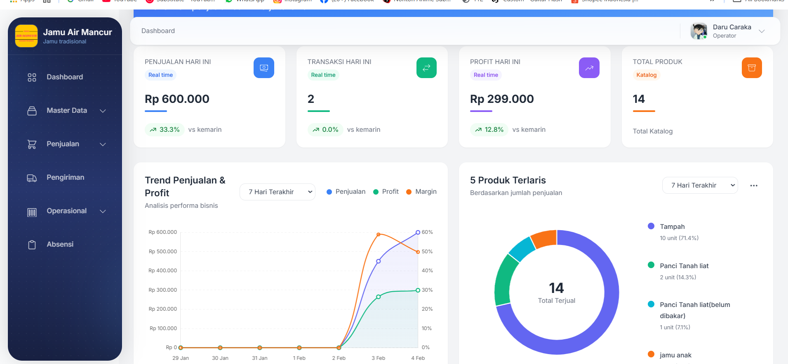
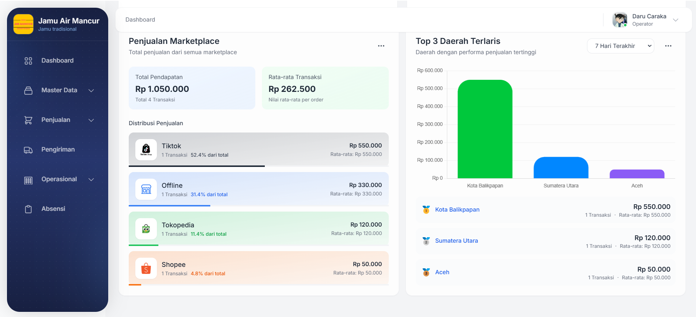

Point of Sales

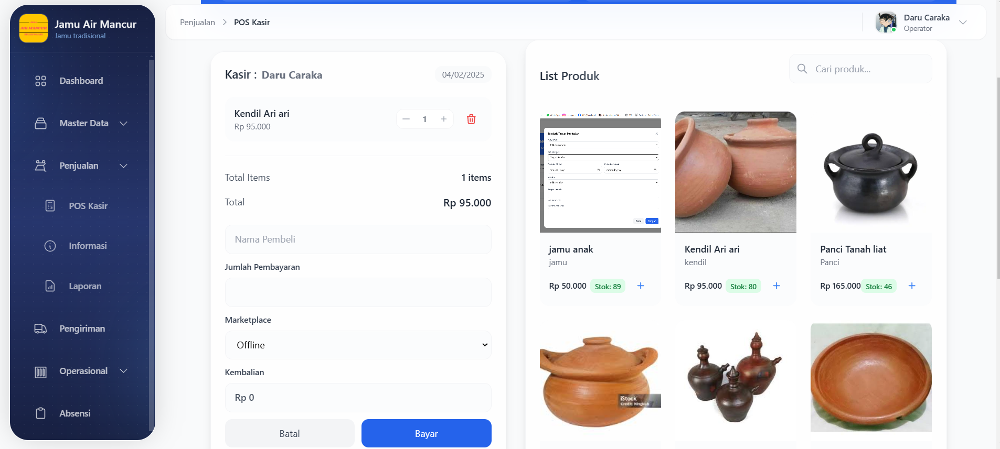

Manajemen Produk

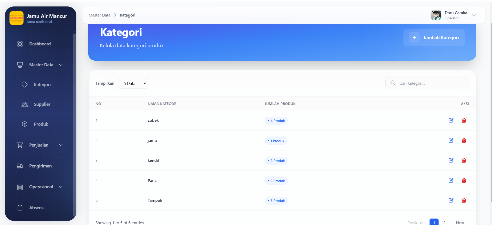
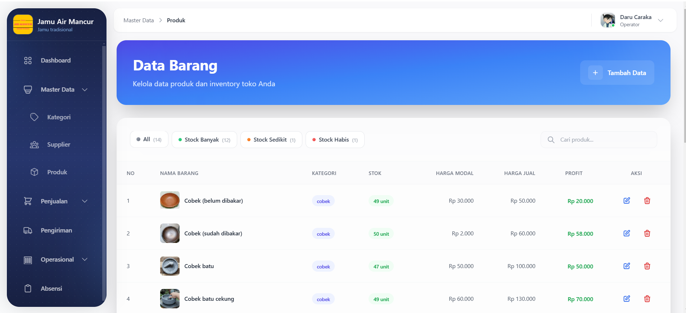
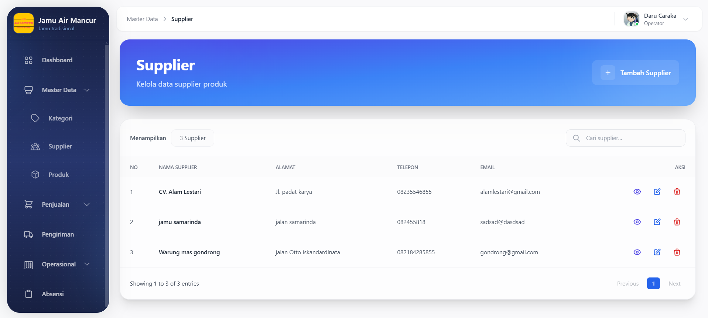

Laporan & Informasi

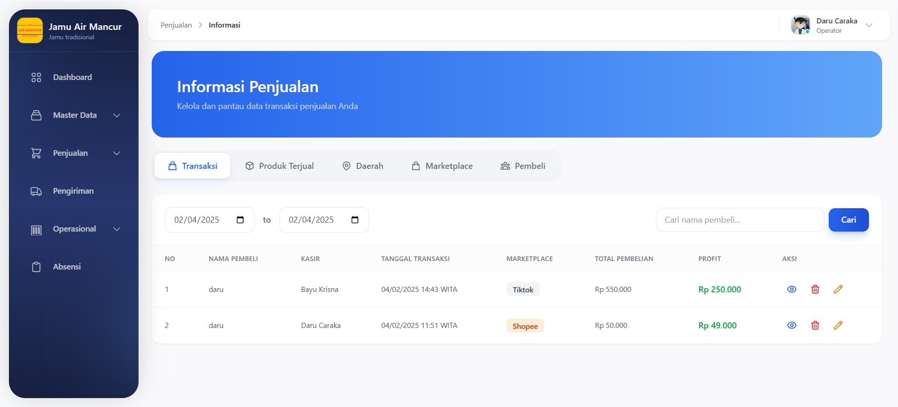
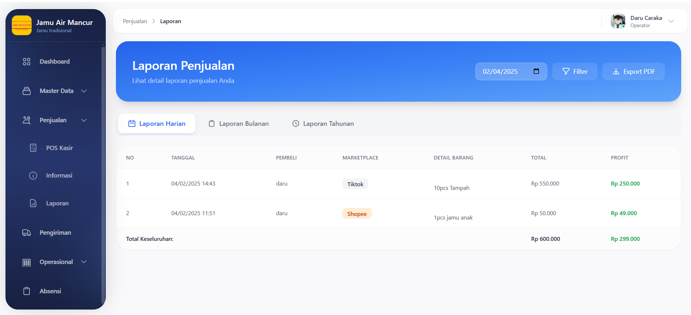

Manajemen Karyawan

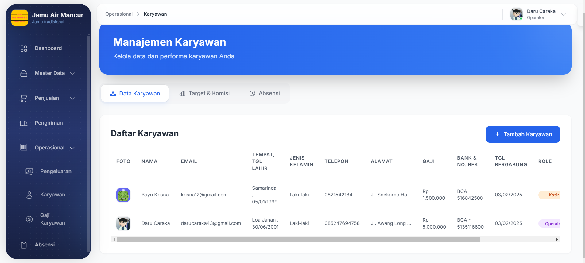
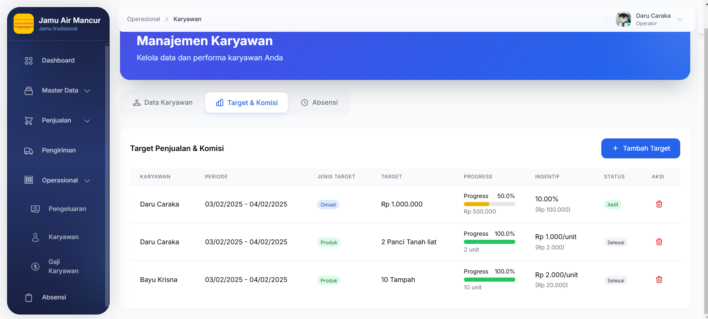
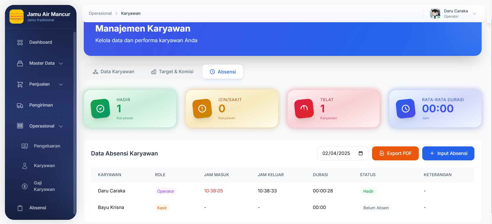
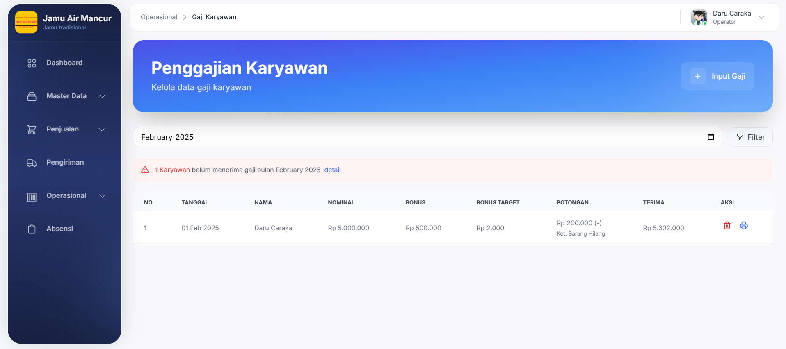
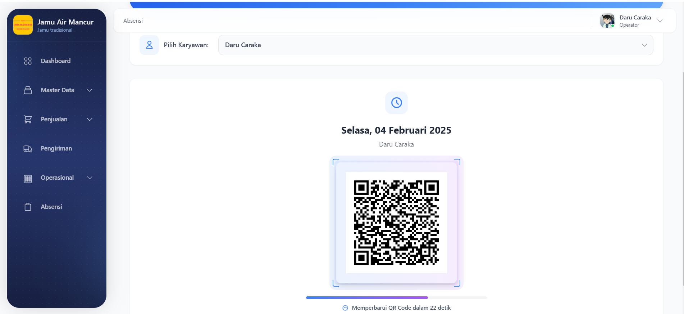

Pengiriman & Pengeluaran

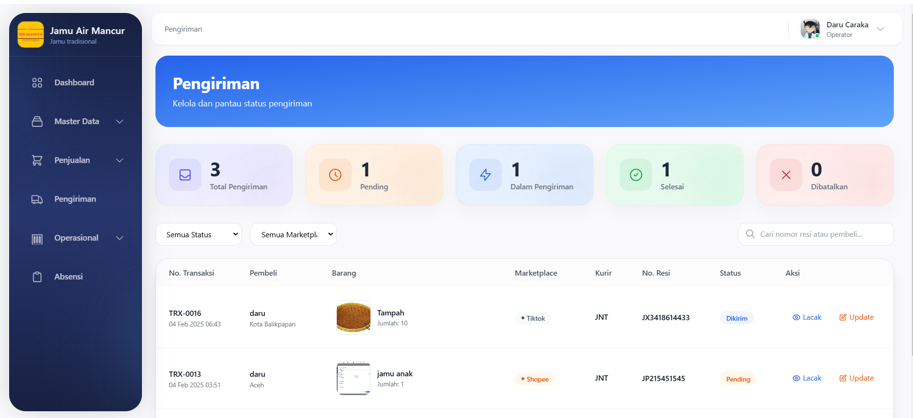
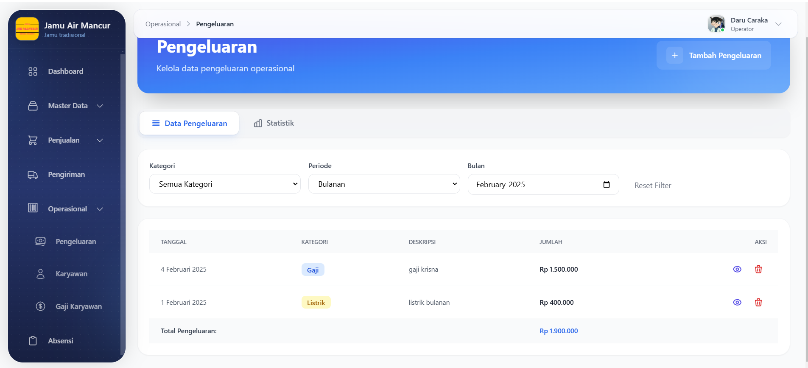
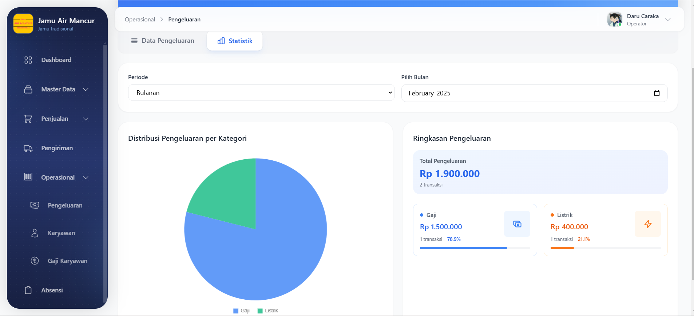

Pengaturan

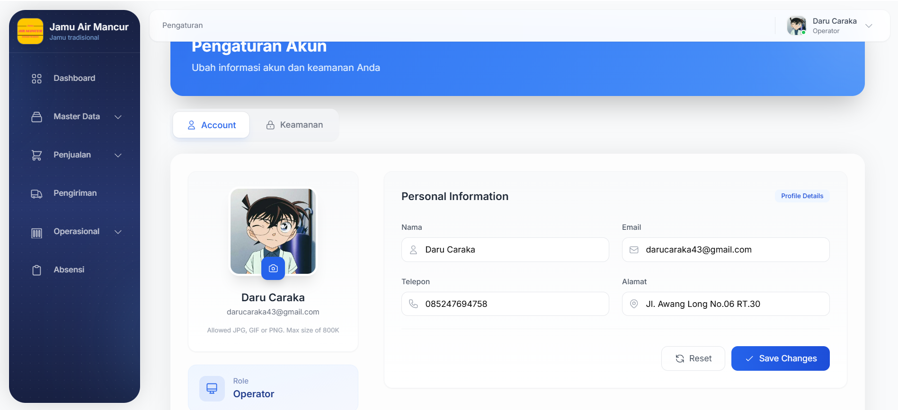

## 📝 Persyaratan Sistem
- PHP >= 8.2
- MySQL >= 5.7
- Web Server (Apache/Nginx)

